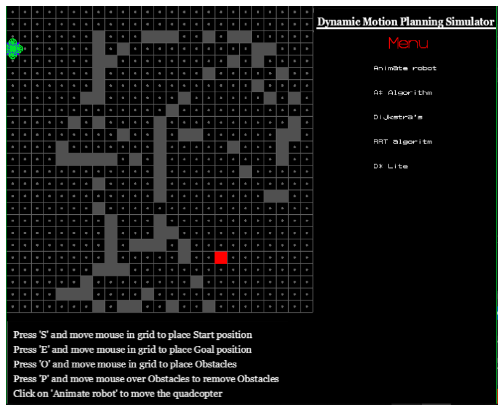
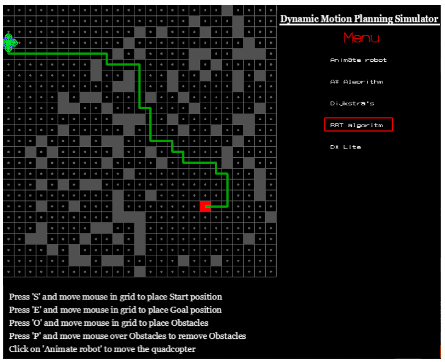

A simulator in C++/OpenGL for visualizing 2D trajectories for a quadrotor. Path planning algorithms include A-Star, D-Star Lite, Dijkstra's, and RRT.  

The user can place obstacles on the path of the quadcopter as the animation is running, and the quadcopter would adapt to new obstacles. However, if an invalid obstacle or path is detected (e.g. if an obstacle is placed behind the quadcopter while it is in motion), the quadcopter will simply restart the animation.

** Compile Instructions  
The package needs the following files included in the project (all files are in folder Graphics_1.1):
Graphics.cpp
* Main_simulator.cpp
* fssimplewindow.cpp
* fssimplewindow.h
* Graphics.h
* robotAnimation.cpp
* ysglfontdata.c
* ysglfontdata.h
* yspng.cpp
* yspng.h

Collaborators: Ashish Roongta, Bryan Zhao, Pranav Narahari, Yayati Jadhav
